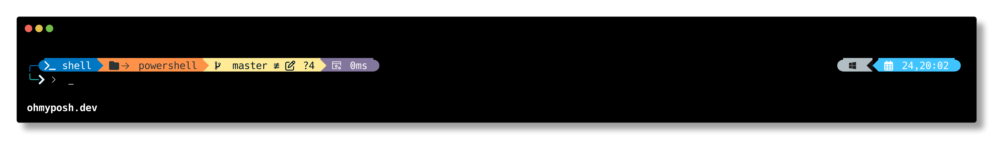
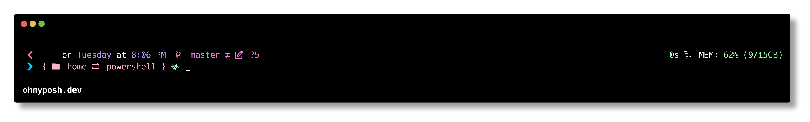
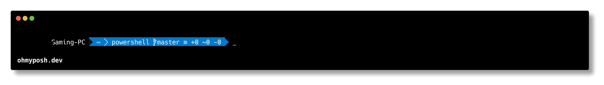
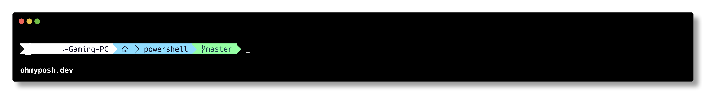
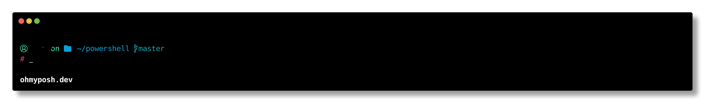

# ⚡ PowerShell Setup with Oh My Posh

A quick setup script to install [Oh My Posh](https://ohmyposh.dev/), configure themes, and beautify your PowerShell terminal experience with centered greetings, Nerd Fonts, and more!

---

## 📦 Prerequisites

### ✅ Install [Windows Terminal](https://aka.ms/terminal)

Download it from the [Microsoft Store](https://aka.ms/terminal) or from the [GitHub releases](https://github.com/microsoft/terminal/releases) page.

---

## 🔤 Install a Nerd Font

Oh My Posh requires a [Nerd Font](https://www.nerdfonts.com) to properly render symbols and icons.

1. Go to [https://www.nerdfonts.com/font-downloads](https://www.nerdfonts.com/font-downloads)
2. Choose a font (recommended: **FiraCode Nerd Font**, **JetBrainsMono Nerd Font**, or **Hack Nerd Font**)
3. Download and extract the ZIP
4. Right-click the `.ttf` files and click **Install for all users**

---

## 🖼️ Set the Nerd Font in Your Editors

### Windows Terminal

1. Open Windows Terminal
2. Click the dropdown arrow → **Settings**
3. Choose your PowerShell profile
4. Scroll to **Appearance** → **Font face**
5. Set it to your installed Nerd Font (e.g. `FiraCode Nerd Font`)

### VS Code

1. Open VS Code
2. Press `Ctrl + ,` to open settings
3. Search for `font family`
4. Set it to:

   ```
   FiraCode Nerd Font, Consolas, 'Courier New', monospace
   ```

---

## ⚙️ Setup Instructions

1. Clone this repository:

   ```bash
   git clone https://github.com/your-username/pwsh-setup.git
   cd pwsh-setup
   ```

2. Run the setup script in **PowerShell**:

   ```powershell
   .\setup.ps1
   ```

3. When prompted, allow it to overwrite your PowerShell profile with the centered greeting and Oh My Posh setup.

---

## 📁 Folder Structure

```
pwsh-setup/
├── setup.ps1          # Main installer script
├── startup.ps1        # PowerShell profile script
└── themes/            # Oh My Posh themes (.omp.json)
    ├── atomic.omp.json
    └── midnight.omp.json
```

---

## 🎭 Changing Themes

You can easily switch between themes by editing your PowerShell profile:

1. Open your PowerShell profile:

   ```powershell
   notepad $PROFILE
   ```

2. Find the line:

   ```powershell
   $themeName = "THEME"
   ```

3. Change `"THEME"` to the name of another theme file (e.g. `"atomic"`):

   ```powershell
   $themeName = "midnight"
   ```

4. Save the file and restart PowerShell — your new theme will be applied!

---

## 💡 After Setup

✅ Launch **PowerShell in Windows Terminal**  
🎨 You should see a centered welcome message and a custom Oh My Posh theme  
🔠 Your font should display icons correctly (if a Nerd Font is installed)

---

## 💡 Theme Previews

Below are some of the themes included in this setup. You can preview them before switching:

### 🎯 `atomic`



### 🌀 `1_shell`



### ⚡ `agnoster.minimal`



### 🧭 `agnoster`



### 🎨 `amro`

## 

---

Made with ❤️ by [vencordthemer](https://linky-s.pages.dev/vencordthemer)
